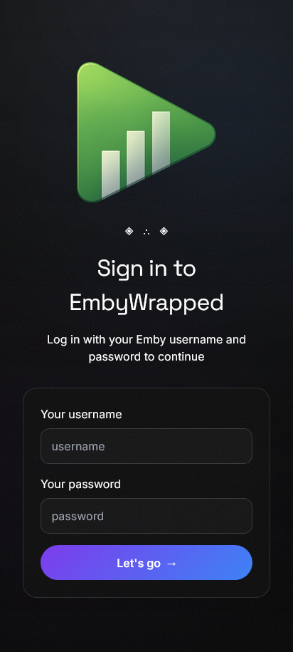
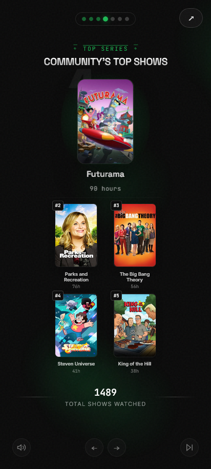
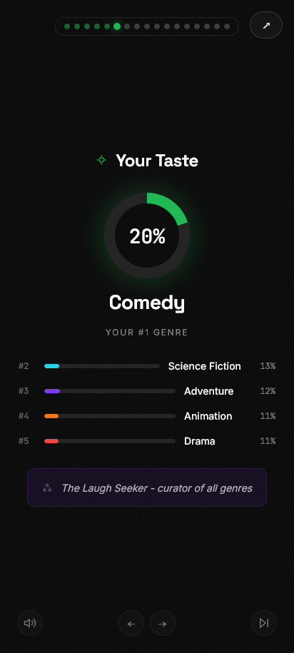
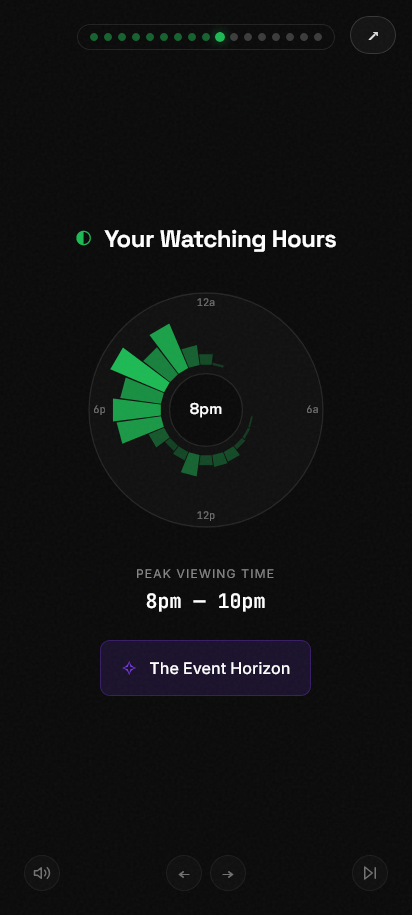
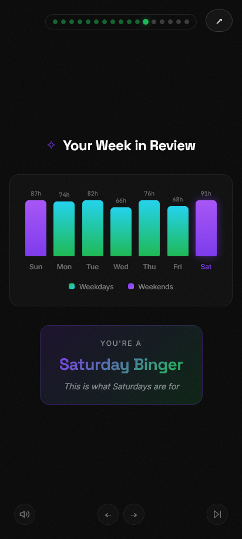
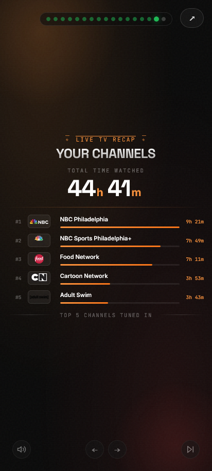

# </img> Emby Wrapped (Enhanced)

A beautiful, Spotify Wrapped-style year-in-review experience for your Emby media server. This fork includes enhanced music statistics, improved image handling, and more detailed viewing patterns.


## Features

This version (`emby-wrapped`) adds several features and improvements over the original:

- **Enhanced Music Statistics** - Detailed breakdown of top artists and tracks with full image support.
- **Image Proxy & Caching** - Built-in image proxy to solve CORS issues and provide persistent caching for faster loading.
- **Flexible Time Ranges** - Support for both yearly and monthly "Wrapped" views.
- **Library Filtering** - Use `FILTER_USER_ID` to restrict displayed content (e.g., to hide NSFW libraries).
- **High-Quality Visuals** - Automatically fetches higher resolution posters and artist images.
- **Improved Error Handling** - Robust handling of missing images and server connection issues.
- **URL parameters** - Provide URLs with a pre-selected time-frame
- **Emby authentication** - Added security via Emby authentication. Users must log in to see stats
- **Seerr integration** - Optional Seerr integration showing number of requests and broken down by movie, series, and user
- **Tracearr integration** - The Emby Playback Reporting Plugin is no longer required - you can use history data from Tracearr instead 
- **Total Watch Time** - See how many days/hours you've spent watching
- **Top Shows and Movies** - Your most-watched content with beautiful poster displays
- **Genre Breakdown** - Discover your viewing preferences
- **Viewing Patterns** - Peak hours and favorite days of the week
- **Viewing Personality** - Fun personality type based on your habits
- **Binge Sessions** - See your longest viewing marathons
- **Monthly Journey** - Track your viewing across the year
- **Device breakdown** - See which devices you watched on
- **Live TV** - See Live TV time watched and top 5 channels
- **Share Cards** - Download individual stat cards to share

## Screenshots

<p>
  
  
  
  
  
  
</p>

## Requirements

### Emby Server Setup

1. **Emby Server** and API Key- Version 4.7+ recommended
   - Go to Emby Dashboard → API Keys
   - Create a new API key for "Emby Wrapped"
   - Copy the key for configuration
3. **Playback Reporting Plugin** (Required unless using Tracearr)
   - Go to Emby Dashboard → Plugins → Catalog
   - Search for "Playback Reporting"
   - Install and restart Emby server
   - This plugin tracks detailed playback history needed for stats
4. [**Tracearr**](https://github.com/connorgallopo/tracearr) (optional)
   - If you use Tracearr integration (`TRACEARR_URL` + `TRACEARR_API_KEY`), Emby Wrapped can read playback history from Tracearr instead
   - If Tracearr usernames differ from current Emby usernames, use `TRACEARR_USERNAME_ALIASES` to map old names to current names
   - If both the Playback Reporting Plugin and Tracearr are configured, Tracearr data will be used
5. [**Seerr**](https://github.com/seerr-team/seerr) (optional)
   - Enable to view request stats

## Quick Start with Docker (Recommended)

### Option 1: Using Pre-built Image from GHCR (Easiest)

Pull the image from GitHub Container Registry and run:

1. Create a directory for your setup:
```bash
mkdir emby-wrapped && cd emby-wrapped
```

2. Create a `docker-compose.yml` file:
```yaml
version: '3.8'
services:
  emby-wrapped:
    image: ghcr.io/ctznsniiips/emby-wrapped:latest
    container_name: emby-wrapped
    ports:
      - "3003:3003"
    environment:
      - EMBY_URL=http://your-emby-server:8096
      - EMBY_API_KEY=your-api-key-here
      - TMDB_API_KEY=    # Optional: for enhanced poster images
      - SEERR_URL=       # Optional: Overseerr/Jellyseerr URL for request stats
      - SEERR_API_KEY=   # Optional: Overseerr/Jellyseerr API key
      - TRACEARR_URL=    # Optional: Tracearr URL (uses Tracearr history instead of Playback Reporting)
      - TRACEARR_API_KEY= # Optional: Tracearr public API key (format: trr_pub_*)
      - TRACEARR_USERNAME_ALIASES= # Optional: oldname1:newname1,oldname2:newname2
      - TRACEARR_PAGE_CONCURRENCY=4 # Optional: lower if Tracearr drops connections under load
      - PUBLIC_URL=      # Optional: for share links
      - CACHE_TTL=86400  # Optional
      - FILTER_USER_ID=  # Optional: filter by user's library
      - PORT=3003       # Optional: app listen port inside container
      - STATS_CACHE_DIR=/app/cache          # Optional: see Caching section below
      - CACHE_WARMUP_ENABLED=true            # Optional
      - CACHE_WARMUP_CONCURRENCY=1           # Optional
      - CACHE_WARMUP_DELAY_MS=1000           # Optional
      - CACHE_REFRESH_INTERVAL_MINUTES=15    # Optional
    volumes:
      - ./music:/app/static/music:ro  # Optional: custom background music
      - stats-cache:/app/cache        # Optional but recommended: persists the stats cache across restarts
    restart: unless-stopped

volumes:
  stats-cache:
```

3. Run:
```bash
docker compose up -d
```

4. Access at `http://localhost:3003`

### Updating

**Pre-built image:**
```bash
docker-compose pull && docker-compose up -d
```

## Local Development

### Prerequisites

- Node.js 18+
- npm or pnpm

### Setup

1. Clone the repository:
```bash
git clone https://github.com/ctznsniiips/emby-wrapped.git
cd emby-wrapped
```

2. Install dependencies:
```bash
npm install
```

3. Create environment file:
```bash
cp .env.example .env
```

4. Edit `.env` with your Emby server details:
```env
EMBY_URL=http://your-emby-server:8096
EMBY_API_KEY=your-api-key-here
```

5. Start development server:
```bash
npm run dev
```

6. Open `http://localhost:5173` in your browser

### Building for Production

```bash
npm run build
npm run preview
```

## Configuration

| Variable | Description | Required |
|----------|-------------|----------|
| `EMBY_URL` | Full URL to your Emby server (e.g., `http://192.168.1.100:8096`) | Yes |
| `EMBY_API_KEY` | API key from Emby Dashboard | Yes |
| `TMDB_API_KEY` | TMDB API key for enhanced poster images (get one free at themoviedb.org) | No |
| `SEERR_URL` | Seerr/Overseerr/Jellyseerr base URL for request stats (e.g., `http://192.168.1.100:5055`) | No |
| `SEERR_API_KEY` | Seerr/Overseerr/Jellyseerr API key used to fetch requests (used with `SEERR_URL`) | No |
| `TRACEARR_URL` | Tracearr base URL (e.g., `http://192.168.1.100:3001`). When set with `TRACEARR_API_KEY`, history data is pulled from Tracearr instead of Emby's Playback Reporting plugin. | No |
| `TRACEARR_API_KEY` | Tracearr Public API key (`trr_pub_*`) used with `TRACEARR_URL`. | No |
| `TRACEARR_USERNAME_ALIASES` | Optional case-insensitive username mapping for Tracearr-to-Emby matching after renames. Format: `oldname1:newname1,oldname2:newname2`. | No |
| `TRACEARR_PAGE_CONCURRENCY` | How many Tracearr history pages to fetch concurrently per request (default: `4`). Lower this if your Tracearr instance drops connections under sustained load. | No |
| `PUBLIC_URL` | Public URL for share links (defaults to request origin) | No |
| `ANALYTICS_SCRIPT` | Analytics script tag (e.g., Umami, Plausible) to inject into page head | No |
| `FILTER_USER_ID` | Emby User ID to use for library filtering (useful for hiding NSFW content) | No |
| `CACHE_TTL` | Cache duration in seconds for statistics (default: 86400) | No |
| `PORT` | Server port used by the app/container (default: `3003`). | No |
| `STATS_CACHE_DIR` | Directory for the per-user stats cache. Point this at a mounted volume to survive restarts (default: `/tmp/stats-cache` in production, `.cache/stats` in dev — both wiped on restart). | No |
| `CACHE_WARMUP_ENABLED` | Pre-generate the server-wide and per-user caches for every completed year/month at startup instead of computing lazily (default: `true`). | No |
| `CACHE_WARMUP_CONCURRENCY` | How many users' stats to warm at once during startup warmup. Each user's warmup is itself a burst of several requests, so keep this low for a lightweight self-hosted Tracearr/Emby instance (default: `1`). | No |
| `CACHE_WARMUP_DELAY_MS` | Milliseconds to pause after each user's warmup before starting the next, per concurrent slot. Set to `0` to disable (default: `1000`). | No |
| `CACHE_REFRESH_INTERVAL_MINUTES` | How often to check for a newly-completed period and refresh the current, in-progress year and month in the background (default: `15`). | No |

## Caching

Emby Wrapped caches two things so repeat visits (and other users looking at the same period) don't re-hit Emby/Tracearr/TMDB every time:

- **Server-wide stats** (the community cards) are cached in memory, shared by every visitor for a given period.
- **Per-user stats** (your personal Wrapped cards) are cached to disk, one JSON file per `userId`/period, under `STATS_CACHE_DIR`.

A completed year or month can't change, so once it's cached it's kept indefinitely; only the current, in-progress period gets a short TTL. On startup, both caches are pre-generated for every completed period in the background (this doesn't block the app from serving requests), and a recurring job keeps the current period warm and picks up newly-completed periods as months/years roll over. This behavior can be tuned or disabled with the `CACHE_WARMUP_*` variables above.

The recurring refresh force-refreshes **both** "current year" and current *month*, for **both** server-wide and per-user stats, on every tick. That's safe because both decompose a year into per-month buckets and cache each completed month indefinitely (server-wide in `serverStatsCache.ts`, per-user in `userActivityCache.ts`) — refreshing "current year" only ever re-fetches the still-open month, never the whole year-to-date range, no matter how far into the year it is. Earlier versions of this feature fetched a user's entire year-to-date history on every refresh with no partial caching, which was expensive enough to keep a self-hosted Tracearr/Emby instance busy continuously if refreshed often, or left a real visitor to pay for a ~30 second cold recompute if refreshed rarely; the per-month cache removes both problems by making the refresh cheap enough to run on the same schedule as everything else. The warmup and recurring refresh also can't overlap: if a pass is still running when the next is due, the next one is skipped rather than stacking on top of it (this is logged as `[cache-warmup] Skipping ... a previous warmup/refresh pass is still running`).

**If you use Tracearr for history** instead of Emby's Playback Reporting plugin: each user's stats computation already dedupes its own two internal history fetches into one, but warming many users still means many separate full-history requests against Tracearr in a short window. `CACHE_WARMUP_CONCURRENCY` and `CACHE_WARMUP_DELAY_MS` default to conservative values (1 user at a time, 1s between users) for this reason. A single history fetch can also burst several concurrent page requests on its own (`TRACEARR_PAGE_CONCURRENCY`, default `4`) if there's a lot of history to paginate through — independent of the warmup's own pacing. Transient network failures (`ECONNRESET`, a closed socket) are retried automatically a couple of times before giving up; a clean `500` response is not, since retrying won't fix an application error. If warmup logs still show Tracearr errors after that, it's Tracearr struggling with the sustained load rather than a burst — try lowering `TRACEARR_PAGE_CONCURRENCY`, raising `CACHE_WARMUP_DELAY_MS`, or checking Tracearr's own logs for why it's rejecting requests.

**Both caches reset on container restart** unless you mount a volume for `STATS_CACHE_DIR` (the in-memory server-wide cache always resets — that's unavoidable for an in-memory cache — but it re-warms quickly since the warmup runs again at boot). Without a mounted volume, the per-user cache falls back to the container's writable tmpfs (`/tmp`) or, in the default `docker-compose.yml`, the `stats-cache` named volume shown above — either way it's rebuilt from scratch by the startup warmup after every restart. Mounting a persistent volume at `/app/cache` (the default in the compose example) avoids that full re-warm and keeps stats instantly available immediately after a restart.

## Background Music

Emby Wrapped supports custom background music during the presentation. To add your own tracks:

1. Create a `static/music/` directory in the project
2. Add MP3 files to the directory
3. Music will automatically play during the wrapped experience

For Docker deployments, mount a volume to `/app/static/music/` (see docker-compose example).

## Usage

### General use
1. Navigate to the app in your browser
2. Log in using an Emby username and password for your Emby instance
3. Select the time period (Year or Month) you want to view
4. Enjoy your personalized Emby Wrapped experience!
5. Use the Share button on any card to download it as an image

### URL parameters
Provide time-specific URLs for your users

Add `?YYYY` or `?MM-YYYY` to your url to pre-select the time period where `MM` is the 2 digit month and `YYYY` is the 4 digit year

#### Example
> `http://yourip:3003?2025` - will pre-select the year 2025 review after the user logs in

## Tech Stack

- **Framework**: SvelteKit
- **Styling**: Tailwind CSS
- **Animations**: CSS animations + Svelte transitions
- **Image Capture**: html2canvas
- **Fonts**: Space Grotesk, JetBrains Mono

## Security Considerations

- API keys are stored server-side only and never exposed to the client
- All Emby API requests are proxied through the server
- No user data is stored - stats are fetched fresh each time
- CORS is handled server-side

## Troubleshooting

### "No users found"
- Verify your `EMBY_URL` is correct and accessible
- Check that your `EMBY_API_KEY` has sufficient permissions

### Stats seem incomplete
- Make sure the **Playback Reporting** plugin is installed (or that Tracearr is running and configured)
- The plugin needs time to collect data - it only tracks plays after installation
- Check the date range - Emby Wrapped shows current year stats

### Images not loading
- Ensure your Emby server is accessible from the Emby Wrapped container/server
- Check for any firewall rules blocking the connection

## Contributing

Contributions are welcome! Feel free to submit a Pull Request. Please base any PRs on the beta branch.

## License

This project is licensed under the MIT License - see the [LICENSE](LICENSE) file for details.

## Acknowledgments

- Thanks to [**davidtorcivia**](https://github.com/davidtorcivia) for the original emby-wrapped-ftp
- Additional thanks to [**tonghongte**](https://github.com/tonghongte) for their emby-wrapped-ftp fork
- Inspired by Spotify Wrapped
- Built for the Emby community
- Uses the Emby API for data retrieval
- Additional thanks to [Tracearr](https://github.com/connorgallopo/Tracearr) and [Seerr](https://github.com/seerr-team/seerr) project contributors
